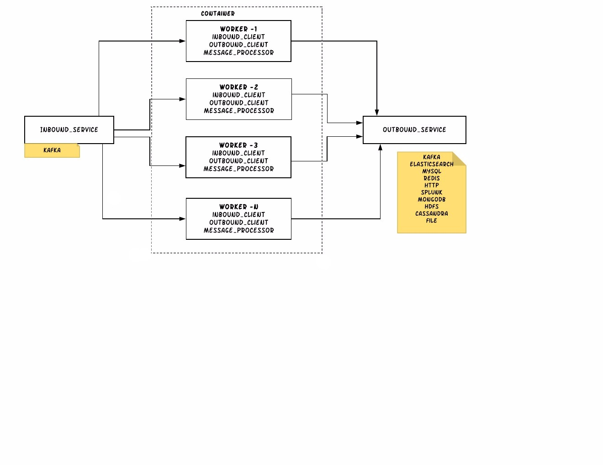

## kafka_project

## Introduction
Kafka Project is a framework to process your received message from inbound client and sends to outbound client.

Currently, this project supports only one kafka inbound client and two
outbound clients - kafka and file client

## Purpose
- As almost every architecture needs an inbound and outbound client to
receive and send the data. This is a complex system to build with taking
care of edge scenarios and repeated code.
- This framework helps someone who can inject his business logic without
worrying about inbound and outbound clients.
- This project takes care of scaling and can handle multiple workers/thread
automatically.


## Architecture


## Installation:

```
git clone https://github.com/pavan538/kafka_project.git
cd kafka_project
python setup.py install
```

## currently supported inbound and outbound clients

| Inbound       | Outbound      |
| ------------- | ------------- |
| kafka_consumer| kafka_producer|
|               | file_writer   |


## kafka_consumer inbound settings

      {
        "name":"kafka_consumer",
        "config": {
            "topics": ["ARTICLE"],
            "max_retries": 3,
            "max_records": 1,
            "poll_timeout": 100,
            "close_timeout": 5,
            "enable_external_commit": true,
            "external_commit_config":{
              "redis":{
                "namespace": "kafka",
                "delimiter": ":",
                "client_config" : {
                  "host": "localhost",
                  "port": 6379,
                  "password": null,
                  "db_number": null,
                  "max_connections": 2
                }
              }
            },
            "client_config":{
                "bootstrap_servers": "172.16.15.227:9092",
                "group_id": "ARTICLE_CG_GRP",
                "enable_auto_commit": false,
                "session_timeout_ms": 27000,
                "heartbeat_interval_ms": 9000,
                "auto_offset_reset": "earliest",
                "max_poll_interval_ms": 100
        	}
        }

      }

## kafka_producer outbound settings :

    {
        "name": "kafka_producer",
        "config": {
            "topic": "ARTICLE",
            "future_timeout": 5,
            "close_timeout": 5,
            "client_config": {
                "bootstrap_servers": "172.16.15.227:9092",
                "acks": 1,
                "retries": 1,
                "batch_size": 16384,
                "linger_ms": 5,
                "buffer_memory": 33554432,
                "connections_max_idle_ms": 54000,
                "max_block_ms": 60000,
                "max_request_size": 1048576,
                "metadata_max_age_ms": 300000,
                "retry_backoff_ms": 100,
                "request_timeout_ms": 30000,
                "max_in_flight_requests_per_connection": 5
            }
        }
    }


- **Note**: current framework allows only Kafka Consumer Group approach.
In feature we will be adding manual partition assignment approach.
for consumer group and manual assignments reference please read the [kafka-python consumer API](http://kafka-python.readthedocs.io/en/master/apidoc/KafkaConsumer.html)

- for kafka inbound client, we can decide num of workers based on partitions of a topic/topics.
- if we specify only one topic, make sure that num_of_workers are less than or equal to number of partitions.
- if we specify more than one topic, make sure that the total number of workers are less than or equal to
total number of partitions of all the topics.

## File outbound client settings for :
```
outbound_client_settings = {
    'name': 'file_writer',
    'config': {
        'file': '/home/pavan/file_writer{}.log',
        'mode' : 'ab',
        'encoding': None,
    }
}
```
- For **File** outbound client, for each worker the output file will be appended with thread id as suffix.


### sample settings json for kafka inbound client and kafka outbound client :
```
{

    "num_of_workers": 3,
    "inbound_client_settings": {
        "name":"kafka_consumer",
        "config": {
            "topics": ["ARTICLE"],
            "max_retries": 3,
            "max_records": 1,
            "poll_timeout": 100,
            "close_timeout": 5,
            "enable_external_commit": true,
            "external_commit_config":{
              "redis":{
                "namespace": "kafka",
                "delimiter": ":",
                "client_config" : {
                  "host": "localhost",
                  "port": 6379,
                  "password": null,
                  "db_number": null,
                  "max_connections": 2
                }
              }
            },
            "client_config":{
                "bootstrap_servers": "172.16.15.227:9092",
                "group_id": "ARTICLE_CG_GRP",
                "enable_auto_commit": false,
                "session_timeout_ms": 27000,
                "heartbeat_interval_ms": 9000,
                "auto_offset_reset": "earliest",
                "max_poll_interval_ms": 100
        	    }
        	}
    	},
    "outbound_client_settings": {
        "name": "kafka_producer",
        "config": {
            "topic": "ARTICLE",
            "future_timeout": 5,
            "close_timeout": 5,
            "client_config": {
                "bootstrap_servers": "172.16.15.227:9092",
                "acks": 1,
                "retries": 1,
                "batch_size": 16384,
                "linger_ms": 5,
                "buffer_memory": 33554432,
                "connections_max_idle_ms": 54000,
                "max_block_ms": 60000,
                "max_request_size": 1048576,
                "metadata_max_age_ms": 300000,
                "retry_backoff_ms": 100,
                "request_timeout_ms": 30000,
                "max_in_flight_requests_per_connection": 5
            }
        }
    }
}
```


## Implementation:

we need to import `Container` class from `framework.container` module. It is a static class which handles and manages the workers.
Currently we are using thread based approach for creating workers.
Thread based approach suits because most of the clients are thread safe.

for **create_container** method, we need to pass **target_func** and **settings_json**.
for kafka inbound client the **target_func** argument is Kafka-python ConsumerRecord object. see [kafka-python API](http://kafka-python.readthedocs.io)

- sample business logic target_func:
    ```
    class MessageProcessor:

    @staticmethod
    def get_and_send(message):
        return message.value

    ```

- In our Applicatioin:
    ```
    from framework.container import Container
    Container.create_container(MessageProcessor.get_and_send , settings_json)
    Container.start()
    ```


- if we need to stop the application by killing it or by pressing `CTRL+c`, we need to stop the Container by calling `stop` method of the `Container` class.
    - sample signal handler code
        ```
        # signal handler for Ctrl+C key press
        def signal_handler(signal, frame):
        logger.info('pressed Ctrl+C!')
        Container.stop()
        sys.exit(0)

        signal.signal(signal.SIGINT, signal_handler)
        signal.signal(signal.SIGTERM, signal_handler)
        ```

## Tests:
Test environments are managed via tox. The test suite is run via unittest. Individual tests are written using unittest.

**Unit tests:**

To run the tests locally, install tox -- pip install tox See https://tox.readthedocs.io/en/latest/install.html

Then simply run tox, optionally setting the python environment. If unset, tox will loop through all environments.

currently we support python3.5 only
```
tox -e py35
```

to run the docs test:
```
tox -e docs
```


## Issues:
for any issues or bugs please raise here https://github.com/pavan538/kafka_project/issues

